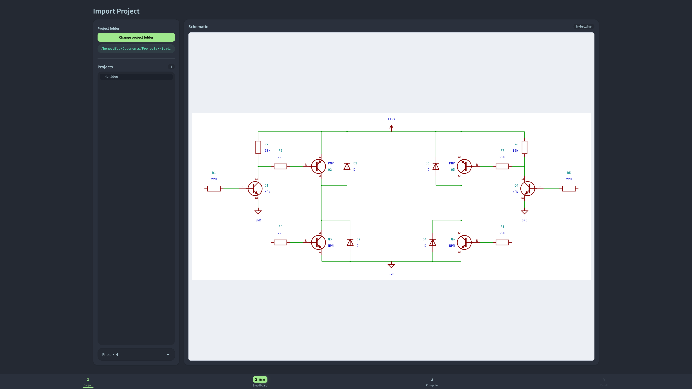
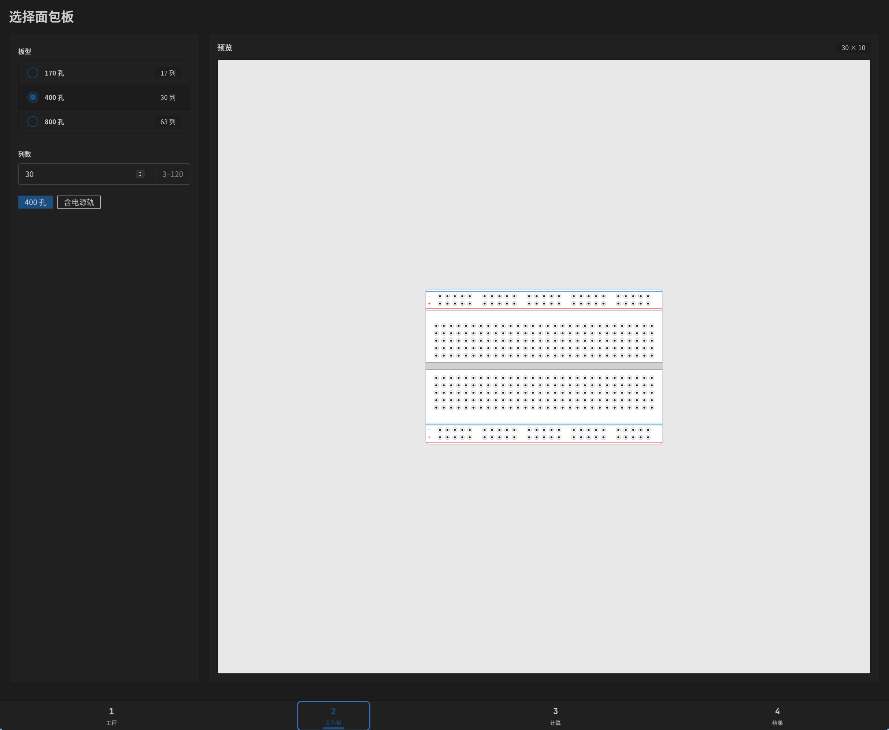
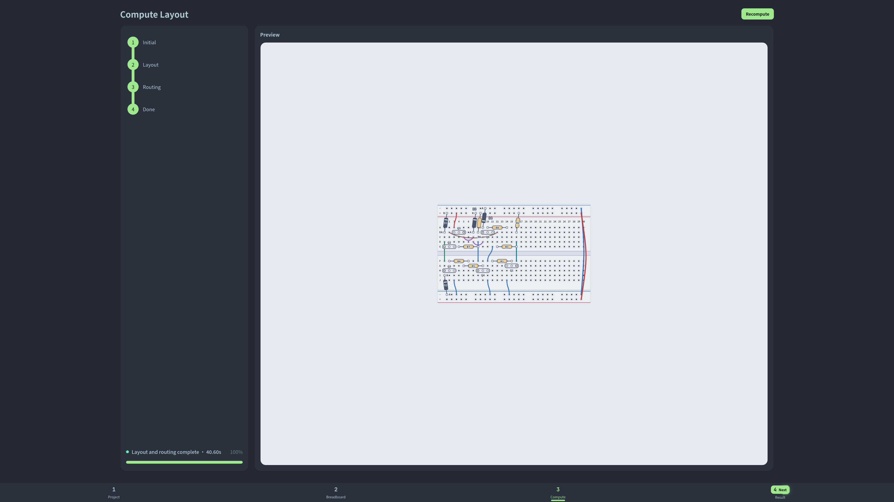
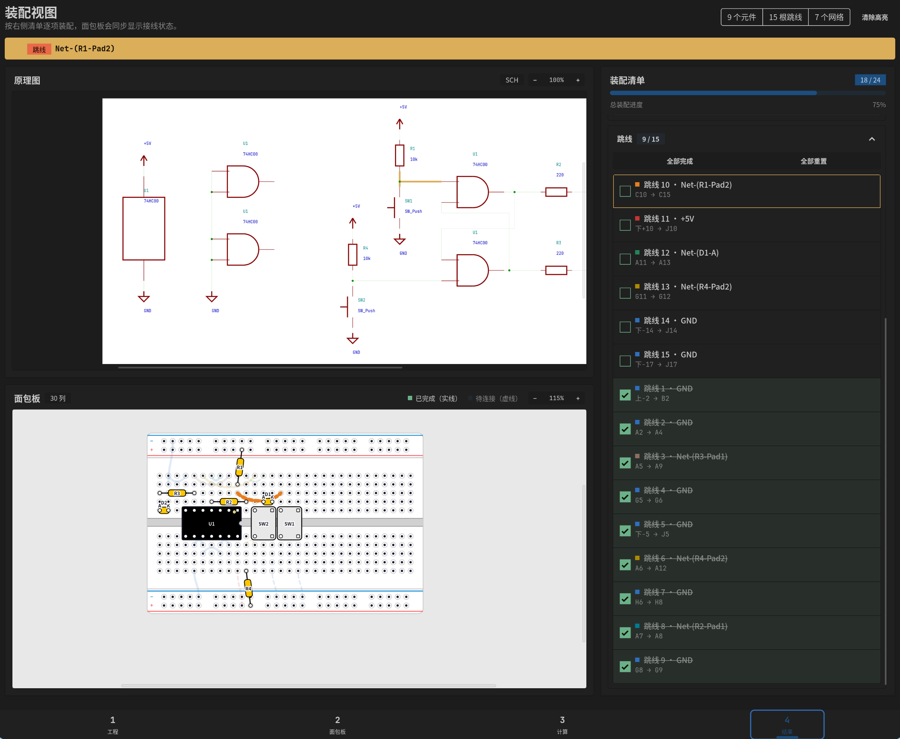

# KneadNet

[English](README.md) | [简体中文](README.zh-CN.md)

> Knead what your nets need.

Schematic → breadboard

## Quick start

1. Install and launch KneadNet.
2. Select or drop a folder containing a KiCad project.
3. Choose a breadboard and bind the power rails.
4. Follow the schematic, breadboard view, and assembly checklist while building the circuit.

## Screenshots

### Import a KiCad project



### Choose a breadboard



### Compute a layout



### Use the assembly view



## Highlights 🌟

- Dark mode and high-DPI support
- Very small installer size
- Keyboard shortcuts

## Download

Download published builds from [GitHub Releases](https://github.com/dfdc1123/knead-net-gui/releases).

| Platform | Recommended file | Notes |
| --- | --- | --- |
| Windows x64 | `KneadNet_<version>_windows_x64-setup.exe` | Installer for most Windows users |
| Windows x64 | `KneadNet_<version>_windows_x64_en-US.msi` | MSI for managed environments |
| macOS Intel / Apple silicon | `KneadNet_<version>_macos_universal.dmg` | Universal application bundle |
| Linux x86-64 | `KneadNet_<version>_linux_amd64.AppImage` | Portable single-file application |
| Debian / Ubuntu x86-64 | `kneadnet_<version>_amd64.deb` | Debian package |
| Fedora / RPM x86-64 | `kneadnet-<version>-1.x86_64.rpm` | RPM package |

Releases also include `SHA256SUMS` for verifying downloads and the [`KneadNet-examples-0.2.3.zip` example archive](https://github.com/dfdc1123/knead-net-gui/releases/download/v0.2.3/KneadNet-examples-0.2.3.zip) for trying the application.

Current builds are not code-signed, so Windows SmartScreen or macOS Gatekeeper may show a warning. Only run files downloaded from this repository, and verify their SHA-256 checksum whenever possible.

An AppImage downloaded through a browser may not have executable permission. Enable it with:

```bash
chmod +x KneadNet_<version>_linux_amd64.AppImage
./KneadNet_<version>_linux_amd64.AppImage
```

Arch Linux users can install the binary package from the [AUR](https://aur.archlinux.org/packages/kneadnet-bin):

```bash
paru -S kneadnet-bin
```

The former `knead-net-gui` package belongs to the naming scheme used before v0.2.0; use `kneadnet-bin` for current releases.

## Example projects

The easiest option is to download the [`KneadNet-examples-0.2.3.zip` example archive](https://github.com/dfdc1123/knead-net-gui/releases/download/v0.2.3/KneadNet-examples-0.2.3.zip) from GitHub. Extract it, then open one of its project folders in KneadNet.

You can also browse the repository's [`examples/` directory](examples/). See [`examples/README.md`](examples/README.md) for the purpose of each example.

## Platform notes

- **Windows:** Tested and supported.
- **AUR:** Tested and supported.
- **Other platforms:** Not tested; feedback is welcome.

## Contributing

Bug reports and focused pull requests are welcome. Include the KneadNet version, operating system, package format, KiCad version, and reproduction steps. Attach a minimal project only when licensing and privacy allow it; never upload a private schematic without permission.

## License

KneadNet is released under the [GNU General Public License v3.0](LICENSE), identified as `GPL-3.0-only`.
